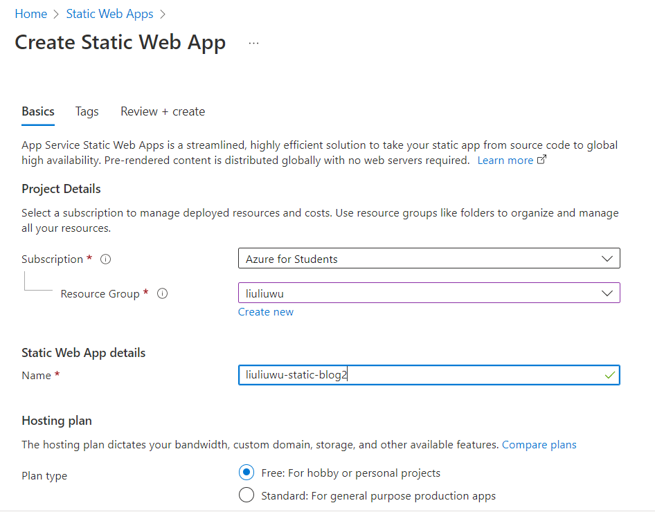

## css rules

1. define the css in specific window size
   "() and ()" -> must have blank space between "and" (!important)

```css
/* When the width is between 600px and 900px OR above 1100px - change the appearance  */
@media (max-width:900px) and (min-width:600px),(min-width:1100px){
    sth
}
```

## TODO

1. 每篇文章下的其他文章链接
2. 使用 flask 搭建
   可以通过 flask 提交表单，可以自己写 RESTful API
   可以避免重复的网页内容设计
   可以做动态网页
3. 与 github page 的对比
   reference：https://bejamas.io/compare/azure-static-web-apps-vs-github-pages/

## workflow

> 前提：需要使用 github 部署网页，需要自己写 html，css，JavaScript 代码，此方法并不适合零代码基础的小白来搭建自己的博客
> 此方法的优势：直接与 GitHub 代码仓连结，当代码仓内修改完成后 pull request 可实现自动更新网站内容；支持 https；对博客的网页设计有全方位的掌控。

### 第一步，上传自己的博客内容代码

1. 在 github 中上传自己的代码，以本文为例，上传至 live-blog2 代码仓的 master branch，同时 create 另一个名为“demo”的 branch，之所以要 create 另一个 branch 的原因会在第四步骤做解释。

### 第二步，利用 azure static web apps 部署网站

1. 登陆页面：https://portal.azure.com -> 使用自己的微软账号灯登陆后，选择订阅方式：free trail （需要有实体信用卡验证身份）或是自费（需要有实体信用卡或是借记卡）；或者通过https://azure.microsoft.com/en-us/free/students/ ->选择 Azure for Students 登陆， Azure for Students 和 free trail 两者都可以可获得 200 美元的 Azure 产品和服务免费额度，以及 12 个月的热门免费服务
   （github 提供给在校学生免费的资源库中包含了 Azure for Students 的学生包，如何获取）
2. 新建资源 (create resource)-> 静态 Web 应用（static web apps）
3. 填写表格
   
   - subsription: 选择自己的订阅方式
     free trail 或是 Purchase Options（自费） 或是 Azure for Students
   - resouce group：可以是之前建立的资源组，可以新建一个资源组
   - name：给自己的 app 取一个名字
   - hosting plan：a) free, b) standard
     对于只是搭建博客来说，free 计划足够用
     两者的区别是，standard 可以在自己的网页中添加用户的身份验证功能（Custom authentication），以及私有终结点（private endpoint，可以使用私有 IP 访问本地资源例如数据库等，而非通过公网 ip 用 internet 访问资源）
   - function api：选择服务器所在地区名称，优先选择离自己近的地方
   - deployment detail：本文以 github 作为部署方式，选择自己的 GitHub 账号，代码仓（repository），以及分支（branch）
   - build details：
     build presets：选择自己网站的搭建框架，本文以自己写的 html，css，JavaScript 为例，选择“Custom”
     app location，搭建的代码在代码仓的所在位置，如果在根目录下，该空格填写“/”
     api location 和 output location 默认不填写
   - review+create：点击创建即可
4. 创建完成之后会有如下所示界面，点击 browse，可预览搭建好的网站

### 第三步，修改域名

1. URL 一栏会显示自动生成的网址，例如本文中的初始网址为“https://happy-bush-0d4cdbc00.2.azurestaticapps.net”，但本文添加了“custom domain”绑定了自己的域名，具体操作如下
   - 购买一个自己的域名，本文通过 GitHub 学生包中 namecheap.com 提供的免费域名资格（如何获取？）
   - 在 namecheap 官网中增加一个新的“CNAME record”，host 为主机域名，可以是“www”，或是自己命名的其他单词如本文中的“blog2”，value 为初始网址除去“https://”后的结果“happy-bush-0d4cdbc00.2.azurestaticapps.net”，TTL 可以理解为设定网页的最长加载时间，本文设定的是 1min。
   - 点击下图中“custom domain”，点击添加按钮“add”，有两个选项：“Azure DNS”和“other DNS”，本文中使用的是 namecheap 提供的 DNS，因此点击第二个。
   - 在弹出的表单中填写“domain name”，由于在 namecheap 中添加的主机域名为“blog2”，购买的 subdomain 为“liuliuwu.me”，因此在该空可填写为“blog2.liuliuwu.me”，下一步点击 add，等待认证（该认证过程需要关闭网络代理 VPN 等服务，可能有延迟，如果显示验证失败，可以多等十几分钟后重复 1.4 步骤重新验证）
   - 验证成功后，在“custom domain”页面显示了两条记录
   - 在网页中输入“https://blog2.liuliuwu.me”，验证绑定域名成功

### 第四步，更新网页内容

1. 由于使用 static web apps 做网站部署时，会自动在 live-blog2 的 github 代码仓中，新建.github/workfolw/xxxx.yml 文件，而本地的 live-blog2 文件夹内，并不包含这个文件，如果直接对修改后的文件在终端使用 git push，live-blog2 的 github 代码仓中的.github/workfolw/xxxx.yml 文件将会消失，而该文件是将 github 与 azure 的工作桥梁，消失后则无法实现自动更新网站内容。
2. 解决办法一：新建一个 branch，本文命名为“demo”，该 branch 内的 file 进行更新，键入如下命令

```bash
git branch demo
git checkout demo
git add file_name
git commit -m "your message"
git push -f blog2 demo
# blog2 is my remote name
```

3. 回到 github 页面，会提示“commit pull request”，点击 commit 即可
4. 此时 github action 会显示正链接 azure，1min 左右会显示更新成功，此时打开页面，可以观察到更新过后的效果。

5. ！！！github 上自动 commit 了 request，虽然可以根据她给的 url 看到的确有更新，但是绑定域名后的网站“blog2.liuliuwu.me”并未更新
6. 解决办法二（更为简单），将原来的 master branch clone 一个到本地，在本地修改完成后，再进行寻常的 push，可以自动的实现网页内容的更新。
7. 将 master 的这个仓也帮一下域名试一下，不知道是不是绑了域名的问题（并不是绑了域名的问题，即使绑了也成功了）

```bash
git add file_name
git commit -m "your message"
git push -f origin master
# origin is my remote name
```
